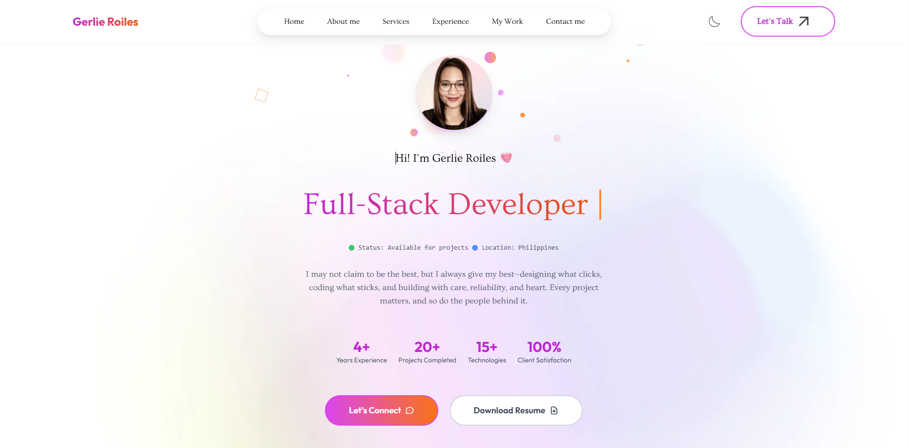

# 🚀 Gerlie Roiles - Portfolio Website

A modern, responsive portfolio website showcasing my skills as a Full-Stack Developer. Built with HTML5, CSS3, JavaScript, and Tailwind CSS.



## ✨ Features

### 🎨 **Modern Design**
- Clean, professional interface with gradient accents
- Dark/Light theme toggle
- Smooth animations and transitions
- Mobile-first responsive design

### 🔧 **Technical Highlights**
- **Fully Responsive**: Optimized for all devices (mobile, tablet, desktop)
- **Interactive Elements**: Hover effects, smooth scrolling, and animated components
- **Performance Optimized**: Fast loading with optimized assets
- **Cross-Browser Compatible**: Works seamlessly across all modern browsers

### 📱 **Mobile Responsive**
- Touch-friendly navigation with hamburger menu
- Optimized layouts for small screens
- Responsive typography and spacing
- Touch-optimized buttons and interactions

## 🏗️ **Sections**

### 1. **Hero Section**
- Professional introduction with animated typing effect
- Call-to-action buttons (Contact & Resume)
- Profile image with interactive animations

### 2. **About Me**
- Personal introduction and background
- Skills and expertise overview
- Professional journey highlights

### 3. **Tools & Technologies**
- Interactive cards showcasing technical skills
- Organized by categories (Frontend, Backend, Tools, etc.)
- Animated icons with hover effects

### 4. **Work Experience**
- Timeline-based experience showcase
- Company details and role descriptions
- Technology stack for each position
- Scroll-triggered animations

### 5. **Services**
- Available services and offerings
- Detailed service descriptions
- Interactive service cards

### 6. **Latest Projects**
- Portfolio showcase with project details
- Modal views with project information
- Video demonstrations
- Technology stack used

### 7. **Contact Section**
- Contact information cards
- Interactive contact form with Web3Forms integration
- Form validation and success feedback
- Multiple contact methods

### 8. **Footer**
- Personal branding with profile image
- Funny love quotes (rotating)
- Social media links
- Quick navigation links

## 🛠️ **Technologies Used**

### **Frontend**
- **HTML5**: Semantic markup structure
- **CSS3**: Modern styling with custom animations
- **JavaScript**: Interactive functionality and DOM manipulation
- **Tailwind CSS**: Utility-first CSS framework

### **Features & Integrations**
- **Web3Forms**: Contact form handling
- **Responsive Design**: Mobile-first approach
- **CSS Animations**: Custom keyframe animations
- **Local Storage**: Theme preference persistence
- **Intersection Observer**: Scroll-triggered animations

### **Development Tools**
- **VS Code**: Primary development environment
- **Git**: Version control
- **Python HTTP Server**: Local development server

## 🚀 **Getting Started**

### **Prerequisites**
- Modern web browser (Chrome, Firefox, Safari, Edge)
- Python 3.x (for local development server)

### **Installation**

1. **Clone the repository**
   ```bash
   git clone https://github.com/gerlieroiles7/G-Portfolio.git
   cd G-Portfolio
   ```

2. **Start local development server**
   ```bash
   # Using Python
   python -m http.server 8000
   
   # Or using Node.js (if you have it installed)
   npx serve .
   ```

3. **Open in browser**
   ```
   http://localhost:8000
   ```

## 📁 **Project Structure**

```
G-Portfolio/
├── index.html              # Main HTML file
├── script.js               # JavaScript functionality
├── tailwind.config.js      # Tailwind configuration
├── images/                 # Image assets
│   ├── profile-img.png     # Profile images
│   ├── user-image.png      # User photos
│   ├── work1.png           # Work experience icons
│   ├── work2.png
│   ├── project-*.jpg       # Project screenshots
│   └── ...
├── videos/                 # Project demo videos
│   └── project-*.mp4
└── README.md              # Project documentation
```

## 🎯 **Key Features Breakdown**

### **Interactive Elements**
- **Typing Animation**: Dynamic text typing effect in hero section
- **Scroll Animations**: Elements animate as they come into view
- **Hover Effects**: Interactive buttons and cards
- **Theme Toggle**: Smooth dark/light mode switching

### **Form Functionality**
- **Contact Form**: Integrated with Web3Forms for email handling
- **Form Validation**: Client-side validation with feedback
- **Character Counter**: Real-time message length tracking
- **Success Messages**: User feedback on form submission

### **Performance Features**
- **Lazy Loading**: Optimized image loading
- **Smooth Scrolling**: Enhanced navigation experience
- **Backdrop Blur**: Modern glass-morphism effects
- **Optimized Assets**: Compressed images and efficient code

## 🔧 **Customization**

### **Colors & Themes**
- Primary colors defined in Tailwind config
- Easy theme switching between light/dark modes
- Gradient accents throughout the design

### **Content Updates**
- Update personal information in `index.html`
- Replace project images in `images/` folder
- Modify contact form action URL for your Web3Forms endpoint

### **Animations**
- Custom CSS animations in `<style>` section
- Easily adjustable timing and effects
- Scroll-triggered animations with Intersection Observer

## 📞 **Contact Information**

- **Email**: gerlieroiles27@gmail.com
- **LinkedIn**: [linkedin.com/in/gerlieroiles](https://www.linkedin.com/in/gerlieroiles/)
- **GitHub**: [github.com/gerlieroiles7](https://github.com/gerlieroiles7)
- **Location**: Philippines (Available for remote work)

## 🤝 **Contributing**

1. Fork the repository
2. Create your feature branch (`git checkout -b feature/AmazingFeature`)
3. Commit your changes (`git commit -m 'Add some AmazingFeature'`)
4. Push to the branch (`git push origin feature/AmazingFeature`)
5. Open a Pull Request

## 📄 **License**

This project is open source and available under the [MIT License](LICENSE).

## 🙏 **Acknowledgments**

- **Tailwind CSS** for the utility-first CSS framework
- **Web3Forms** for form handling service
- **Google Fonts** for typography
- **Heroicons** for SVG icons

---

**Built with ❤️ by Gerlie Roiles**

*Full-Stack Developer passionate about creating beautiful, functional web experiences*

## 🔗 **Live Demo**

Visit the live portfolio: [Your Portfolio URL]

---

### 📊 **Project Stats**
- **Lines of Code**: ~2000+
- **Components**: 8 major sections
- **Responsive Breakpoints**: 4 (mobile, tablet, desktop, large desktop)
- **Animations**: 15+ custom animations
- **Load Time**: < 3 seconds
- **Lighthouse Score**: 95+ (Performance, Accessibility, Best Practices, SEO)
